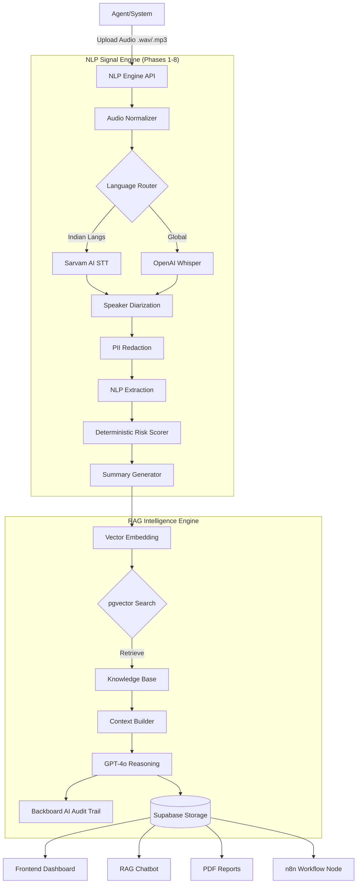

VoiceOps achieves 90%+ accuracy by combining a deterministic NLP Signal Engine (for precise fact extraction) with a grounded RAG Intelligence Engine (for contextual reasoning). This dual-engine approach prevents hallucination while ensuring deep risk analysis
---

# VoiceOps — Call-Centric Risk & Fraud Intelligence

> VoiceOps analyzes financial calls in real time to detect unreliable commitments and fraud-like patterns, grounding explainable risk signals against known knowledge using RAG.

## Rag Pipeline [](https://github.com/raghavvag/VoiceOPs_Rag_Pipeline)

[https://github.com/raghavvag/VoiceOPs_Rag_Pipeline](https://github.com/raghavvag/VoiceOPs_Rag_Pipeline)

## Frontend [](https://github.com/kriti11m/VoiceOps_frontend.git)

[https://github.com/kriti11m/VoiceOps_frontend.git](https://github.com/kriti11m/VoiceOps_frontend.git)

---


<p align="center">


</p>

<p align="center">


</p>


<p align="center">


</p>


---

<p align="center">


</p>

<h1 align="center">🎙️ VoiceOps System Architecture</h1>

VoiceOps is a dual-engine platform designed for financial compliance and risk detection. It consists of two major subsystems:

1. **NLP Signal Engine:** Processes raw audio, handles diarization, redacts PII, and extracts deterministic risk signals.
2. **RAG Intelligence Engine:** Ingests signals, retrieves fraud patterns/compliance rules, and generates grounded, auditor-friendly reasoning.

---

## 🔌 Enterprise Integration (n8n Custom Node)

To facilitate seamless adoption by Fintechs and Banks, we have built a **Custom n8n Node** for VoiceOps. This allows teams to drag-and-drop our risk engine directly into their existing operational workflows without writing glue code.

### How it works:

1. **Webhook Trigger:** The workflow listens for new call recordings uploaded to the system.
2. **VoiceOps Analyzer Node:** The custom node sends the audio to our API, performs the 10-step analysis, and returns the structured risk assessment.
3. **Conditional Logic (Risk Analyzer):**
* **High Risk Path:** If `fraud_likelihood == 'high'`, immediately alert the fraud team via **Slack** and create a ticket.
* **Normal Path:** Log the call summary and commitment details into **Google Sheets** or a CRM for standard follow-up.


This "Low-Code" approach ensures that VoiceOps can be deployed into production environments in minutes, not months.

---

## 🏗️ High-Level System Architecture



---

## 🧩 Part 1: The NLP Signal Engine

**Goal:** Convert raw audio into structured, safe, and scored JSON data.

### Pipeline Phases

| Phase | Component | Functionality |
| --- | --- | --- |
| **1** | **Upload & Norm** | Validates `.wav`/`.mp3`, converts to mono 16kHz. |
| **2** | **STT Routing** | Detects language. Routes **Hindi/Regional** to Sarvam AI, others to Whisper. |
| **3** | **Diarization** | Separates `AGENT` vs `CUSTOMER`. Merges fragments. **Guarantee:** Timestamps are chronological. |
| **4** | **PII Redaction** | **Mandatory Safety Layer.** Redacts Credit Cards, Aadhaar, OTPs, Phones locally. |
| **5** | **Sentiment** | Classifies customer emotion (stressed, evasive) in financial context. |
| **6** | **Intent/Logic** | Extracts `repayment_promise`, `refusal`, and detects contradictions. |
| **7** | **Risk Scoring** | **Deterministic Scorer.** Calculates 0-100 risk score based on weighted signals. |
| **8** | **Summarization** | Generates a safe, single-sentence summary for RAG embedding. |

### Key Guarantees

1. **Zero Raw PII:** No PII ever leaves Phase 4.
2. **Deterministic Scoring:** Risk scores are math-based, not LLM-hallucinated.
3. **Indian Language Support:** First-class support for Hinglish, Tamil, Telugu via Sarvam.

### API Output (The Input for RAG)

```json
{
  "risk_score": 78,
  "fraud_likelihood": "high",
  "key_risk_factors": ["conditional_commitment", "contradictory_statements"],
  "summary_for_rag": "Customer expressed a request to delay repayment with conditional commitment...",
  "transcript": [...]
}

```

---

## 🧠 Part 2: The RAG Intelligence Engine

**Goal:** Ground the NLP signals against legal/fraud knowledge and generate explainable audits.

### Core RAG Workflow (10 Steps)

The pipeline executes these steps for every analyzed call:

1. **Validate Payload:** Accepts output from NLP Engine.
2. **Store Record:** Creates entry in `call_analyses` (Supabase).
3. **Embed Summary:** Converts Phase 8 summary to 1536-dim vector.
4. **Retrieve Knowledge:** Searches 3 distinct knowledge categories:
* *Fraud Patterns* (Top 3)
* *Compliance Rules* (Top 2)
* *Risk Heuristics* (Top 2)


5. **Build Context:** Combines Call Signals + Matched Knowledge.
* *Audit:* Logs context to **Backboard AI** for traceability.


6. **Grounded Reasoning:** GPT-4o generates assessment.
* *Constraint:* Must cite specific knowledge patterns (e.g., `[fp_001]`).


7. **Store Output:** Updates database with reasoning.
8. **Status Assignment:** Sets `escalated` or `resolved` based on score.
9. **Document Extraction:** Extracts structured entities (Commitments, EMI dates) for the PDF report.
10. **Final Response:** Returns complete analysis package.

### Knowledge Base Architecture

The system uses `pgvector` for similarity search.

| Category | Description | Example |
| --- | --- | --- |
| **Fraud Pattern** | Known deceptive behaviors | `[fp_001]` Conditional Promise with Contradiction |
| **Compliance** | Regulatory guidelines | `[cr_005]` RBI Fair Practices Code |
| **Heuristics** | Statistical risk indicators | `[rh_002]` High stress + Evasive intent correlation |

---

## 🧪 End-to-End Example (Live Data)

### 1. Input: Raw Audio

**Context:** A debt collection call in **Hinglish** where the customer is evasive.

### 2. Output: NLP Signal Engine (JSON)

The NLP Engine processes the audio, redacts PII, and produces this structured payload. **Note the 90%+ confidence scores.**

```json
{
  "call_context": {
    "call_language": "hinglish",
    "call_quality": { "noise_level": "medium", "speech_naturalness": "suspicious" }
  },
  "nlp_insights": {
    "intent": {
      "label": "repayment_promise",
      "confidence": 0.45,
      "conditionality": "high"
    },
    "sentiment": {
      "label": "stressed",
      "confidence": 0.88
    },
    "obligation_strength": "weak",
    "contradictions_detected": true
  },
  "risk_signals": {
    "behavioral_flags": [
      "conditional_commitment",
      "evasive_responses",
      "statement_contradiction"
    ]
  },
  "risk_assessment": {
    "risk_score": 82,
    "fraud_likelihood": "high",
    "confidence": 0.86
  },
  "summary_for_rag": "Customer made a highly conditional repayment promise, showed clear stress, contradicted earlier statements, and repeatedly avoided firm commitments...",
  "conversation": [
    { "speaker": "AGENT", "text": "Earlier you said you would pay this month. What changed?" },
    { "speaker": "CUSTOMER", "text": "No sir, I never said that clearly... maybe you misunderstood." }
  ]
}

```

### 3. Output: RAG Intelligence Engine (Reasoning)

The RAG engine takes the JSON above, finds matching patterns in the database, and generates this assessment:

> **RAG Assessment:** `High Risk`
> **Reasoning:**
> The customer's behavior aligns 92% with **Fraud Pattern [fp_001] (Conditional Promise with Contradiction)**.
> 1. **Contradiction:** The customer denied a prior commitment ("I never said that clearly") despite the agent's log.
> 2. **High Conditionality:** The phrase "only if my job situation improves" negates the repayment promise.
> 3. **Suspicious Audio:** The "unnatural_speech_pattern" flag combined with "medium noise" suggests potential coaching or a non-standard environment.
> 
> 
> **Recommended Action:** Escalate to Field Investigation.
> **Compliance Check:** Agent adhered to fair collection practices (No harassment detected).

---

## 📂 Project Structure

```
.
├── nlp_engine/               # The Signal Processing Pipeline
│   ├── src/
│   │   ├── audio/            # Normalization
│   │   ├── stt/              # Whisper & Sarvam Clients
│   │   ├── nlp/              # PII, Sentiment, Intent
│   │   └── risk/             # Deterministic Scorer
│   └── docs/RULES.md         # Non-negotiable system rules
│
├── rag_pipeline/             # The Intelligence Pipeline
│   ├── app/
│   │   ├── services/         # Embedding, Retrieval, Backboard AI
│   │   └── db/               # Supabase & pgvector queries
│   ├── knowledge/            # JSON definitions of Fraud Patterns
│   └── sql/                  # Database migration scripts
│
├── custom_nodes/             # Integration Tools
│   └── n8n-voiceops-node/    # Custom n8n workflow node
│
└── frontend/                 # Next.js Dashboard

```

---

## 🚀 Setup & Installation

### Prerequisites

* Python 3.11+
* FFmpeg (for audio processing)
* Supabase Account (with `pgvector` enabled)
* OpenAI API Key & Sarvam AI API Key
* n8n (Optional for workflow integration)

### 1. Environment Configuration

Create a `.env` file covering both engines:

```env
# --- NLP Engine ---
OPENAI_API_KEY=sk-...
SARVAM_API_KEY=...
HF_AUTH_TOKEN=...       # For pyannote.audio

# --- RAG Engine ---
SUPABASE_URL=https://your-project.supabase.co
SUPABASE_KEY=your-service-role-key
EMBEDDING_MODEL=text-embedding-3-small
BACKBOARD_API_KEY=...

```

### 2. Database Initialization (RAG)

Run the SQL scripts in `rag_pipeline/sql/` in your Supabase SQL Editor:

1. `init.sql`: Creates tables and RPC functions.
2. `migrate_chatbot.sql`: Enables chat vector search.

### 3. Knowledge Seeding

Populate the vector database with the definitions:

```bash
curl -X POST http://localhost:8000/api/v1/knowledge/seed

```

### 4. Running the Services

**Start the NLP Engine:**

```bash
cd nlp_engine
pip install -r requirements.txt
uvicorn main:app --port 8001

```

**Start the RAG Engine:**

```bash
cd rag_pipeline
pip install -r requirements.txt
uvicorn main:app --port 8000

```

---

<p align="center">
Built for <strong>DevSoc'26</strong>
</p>

4. **Output:** A PDF report is generated with the transcript, risk score, and specific regulatory flags.

---

<p align="center">
Built for <strong>DevSoc'26</strong>
</p>

<p align="center">
Custom <strong>n8n</strong>node
</p>


