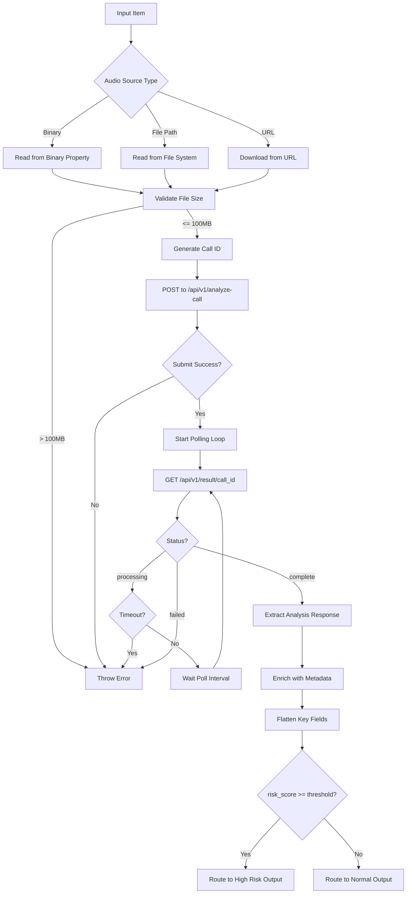
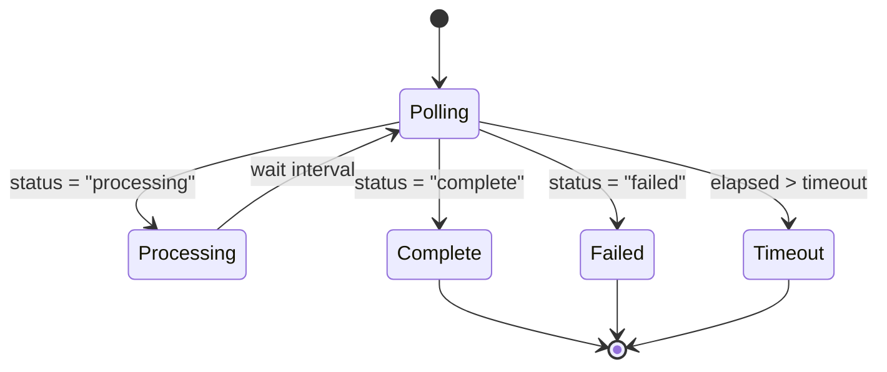

# Design Document: VoiceOps Analyze Call Node

## Overview

The VoiceOps Analyze Call node is a custom n8n community node that integrates fraud detection capabilities into n8n workflows. The node accepts audio files in multiple formats, submits them to the VoiceOps FastAPI backend for analysis, polls for completion, and routes workflow execution through two distinct outputs based on configurable risk thresholds.

### Key Design Principles

1. **Dual-Output Routing**: Strict separation between high-risk and normal calls with mutually exclusive routing
2. **Independent Processing**: Each input item is processed independently without shared state
3. **Graceful Degradation**: Missing risk scores default to safe routing with metadata warnings
4. **n8n Compliance**: Full adherence to n8n community node architecture and conventions
5. **Downstream Compatibility**: Flattened output structure optimized for Slack and Google Sheets integration

### Technology Stack

- **Language**: TypeScript with strict typing
- **Platform**: n8n community node framework
- **HTTP Client**: n8n's `this.helpers.httpRequest()`
- **Error Handling**: n8n's `NodeOperationError`

## Architecture

### High-Level Flow



### Component Structure

```
VoiceOpsAnalyzeCall.node.ts
├── Node Class (implements INodeType)
│   ├── description: INodeTypeDescription
│   └── execute(): Promise<INodeExecutionData[][]>
│
├── Audio Input Handler
│   ├── readBinaryInput()
│   ├── readFilePathInput()
│   └── readUrlInput()
│
├── Validation Module
│   └── validateFileSize()
│
├── API Client
│   ├── submitAudioForAnalysis()
│   └── pollForResults()
│
├── Polling Engine
│   ├── pollWithTimeout()
│   └── checkStatus()
│
├── Response Processor
│   ├── extractRiskScore()
│   ├── enrichWithMetadata()
│   └── flattenKeyFields()
│
└── Router
    └── routeByRiskScore()
```

## Components and Interfaces

### 1. Node Description (INodeTypeDescription)

The node description defines the node's identity, credentials, and parameters.

```typescript
{
  displayName: 'VoiceOps Analyze Call',
  name: 'voiceOpsAnalyzeCall',
  icon: 'file:voiceops.svg',
  group: ['transform'],
  version: 1,
  description: 'Analyzes financial call recordings for fraud risk using VoiceOps AI and routes calls by risk score',
  defaults: {
    name: 'VoiceOps Analyze Call',
  },
  inputs: ['main'],
  outputs: ['main', 'main'],
  outputNames: ['High Risk', 'Normal'],
  credentials: [
    {
      name: 'voiceOpsApi',
      required: true,
    },
  ],
  properties: [
    // Audio source selection
    // Binary property name
    // File path
    // URL
    // Risk threshold
    // Advanced options (timeout, interval, language)
  ],
}
```

### 2. Credentials Interface

```typescript
interface IVoiceOpsApiCredentials {
  baseUrl: string;
  apiKey?: string;
  webhookSecret?: string;
}
```

### 3. Node Parameters Interface

```typescript
interface IVoiceOpsNodeParameters {
  audioSource: 'binary' | 'filePath' | 'url';
  binaryPropertyName: string;
  audioFilePath: string;
  audioUrl: string;
  riskThreshold: number;
  pollTimeout: number;
  pollInterval: number;
  forceLanguage: 'auto' | 'en' | 'hi' | 'hi-en';
}
```

### 4. Analysis Response Interface

```typescript
interface IAnalysisResponse {
  call_id: string;
  call_timestamp: string;
  input_risk_assessment: {
    risk_score: number;
    fraud_likelihood: 'low' | 'medium' | 'high';
    confidence: number;
  };
  rag_output: {
    explanation: string;
    recommended_action: string;
    matched_patterns: string[];
  };
  backboard_thread_id: string;
}
```

### 5. Poll Response Interface

```typescript
interface IPollResponse {
  status: 'processing' | 'complete' | 'failed';
  result?: IAnalysisResponse;
  error?: string;
}
```

### 6. Enriched Output Interface

```typescript
interface IEnrichedOutput extends IAnalysisResponse {
  // Flattened fields
  risk_score: number;
  fraud_likelihood: string;
  call_id: string;
  explanation: string;
  recommended_action: string;
  matched_patterns: string[];
  
  // Metadata
  _voiceops_meta: {
    risk_threshold_used: number;
    is_high_risk: boolean;
    routed_to: 'high_risk' | 'normal';
    processed_at: string;
    warning?: string;
  };
}
```

## Data Models

### Audio Input Data Model

Audio data can be provided in three formats:

1. **Binary Input**: Audio data from a previous node's binary output
   - Property: `binaryPropertyName` (default: "data")
   - Access: `items[i].binary[binaryPropertyName]`

2. **File Path Input**: Path to audio file on file system
   - Property: `audioFilePath`
   - Read using Node.js `fs` module

3. **URL Input**: HTTP/HTTPS URL to audio file
   - Property: `audioUrl`
   - Download using `this.helpers.httpRequest()`

### Call ID Generation

Call IDs are generated using UUID v4 format to ensure uniqueness across all requests.

```typescript
import { v4 as uuidv4 } from 'uuid';
const callId = uuidv4();
```

### Multipart Form Data Structure

Audio submission uses multipart/form-data encoding:

```typescript
{
  audio: <binary audio data>,
  call_id: <uuid>,
  language?: <language code>
}
```

### Polling State Machine



### Output Routing Decision Tree

```
Input: risk_score, risk_threshold

IF risk_score is undefined OR risk_score is null:
  SET risk_score = 0
  SET warning = "Risk score missing, defaulted to 0"
  ROUTE to Normal Output

ELSE IF risk_score >= risk_threshold:
  ROUTE to High Risk Output (index 0)

ELSE:
  ROUTE to Normal Output (index 1)
```

### Error Object Structure (continueOnFail)

When `continueOnFail` is enabled, errors are returned as objects:

```typescript
{
  json: {
    error: string,
    call_id?: string,
    http_status?: number,
    timestamp: string
  }
}
```

## Correctness Properties

*A property is a characteristic or behavior that should hold true across all valid executions of a system—essentially, a formal statement about what the system should do. Properties serve as the bridge between human-readable specifications and machine-verifiable correctness guarantees.*


### Property 1: Audio Input Mode Routing
*For any* audio source mode (binary, filePath, url) and corresponding audio data, the system should correctly read the audio data from the specified source type.
**Validates: Requirements 1.1, 1.2, 1.3**

### Property 2: Binary Property Name Configuration
*For any* valid binary property name, when binary input mode is selected, the system should read audio data from the specified property name.
**Validates: Requirements 1.5**

### Property 3: Filename Preservation
*For any* audio input with an available filename, the system should preserve the original filename through the submission process.
**Validates: Requirements 1.6**

### Property 4: Multipart Request Format
*For any* audio submission, the HTTP request should use POST method with multipart/form-data encoding to /api/v1/analyze-call.
**Validates: Requirements 2.1**

### Property 5: Call ID Uniqueness
*For any* set of multiple audio analysis requests, all generated Call_IDs should be unique.
**Validates: Requirements 2.2**

### Property 6: Audio Inclusion in Request
*For any* audio submission, the multipart request should contain the audio file data.
**Validates: Requirements 2.3**

### Property 7: Conditional Language Parameter
*For any* analysis request, if a language is specified, the request should include the language parameter; if not specified, the parameter should be omitted.
**Validates: Requirements 2.4**

### Property 8: Base URL Configuration Usage
*For any* configured base URL, all API requests should use that base URL as the endpoint prefix.
**Validates: Requirements 2.5**

### Property 9: Conditional API Key Header
*For any* analysis request, if an API key is configured, the request should include it in the headers; if not configured, the header should be omitted.
**Validates: Requirements 2.6**

### Property 10: Polling Endpoint Correctness
*For any* submitted audio with Call_ID, the system should poll GET /api/v1/result/{call_id} with the correct Call_ID.
**Validates: Requirements 3.1**

### Property 11: Poll Interval Timing
*For any* polling sequence, the time between consecutive polling attempts should match the configured Poll_Interval.
**Validates: Requirements 3.2**

### Property 12: Processing Status Continuation
*For any* polling response with status "processing", the system should continue polling rather than completing or erroring.
**Validates: Requirements 3.3**

### Property 13: Complete Status Processing
*For any* polling response with status "complete", the system should proceed with result processing and stop polling.
**Validates: Requirements 3.4**

### Property 14: Failed Status Error Handling
*For any* polling response with status "failed", the system should throw a NodeOperationError containing failure details.
**Validates: Requirements 3.5**

### Property 15: Timeout Error Handling
*For any* polling sequence where elapsed time exceeds Poll_Timeout, the system should throw a NodeOperationError including the Call_ID.
**Validates: Requirements 3.6**

### Property 16: Risk-Based Routing Correctness
*For any* analysis result with risk_score and risk_threshold, the item should be routed exclusively to High_Risk_Output if risk_score >= risk_threshold, exclusively to Normal_Output if risk_score < risk_threshold, and never to both outputs simultaneously.
**Validates: Requirements 4.1, 4.2, 4.3**

### Property 17: Missing Risk Score Handling
*For any* analysis response missing risk_score, the system should default risk_score to 0, route to Normal_Output, and include a warning in _voiceops_meta.
**Validates: Requirements 4.6, 5.9**

### Property 18: Metadata Enrichment
*For any* output item, the system should add a _voiceops_meta object containing risk_threshold_used, is_high_risk, routed_to, and processed_at fields.
**Validates: Requirements 5.1**

### Property 19: Field Flattening Completeness
*For any* analysis response, the output should include flattened top-level fields for risk_score, fraud_likelihood, call_id, explanation, recommended_action, and matched_patterns.
**Validates: Requirements 5.2, 5.3, 5.4, 5.5, 5.6, 5.7**

### Property 20: Original Structure Preservation
*For any* analysis response, the output should preserve the complete original Analysis_Response structure in addition to flattened fields.
**Validates: Requirements 5.8**

### Property 21: Error Type Correctness
*For any* runtime error, the system should throw a NodeOperationError instance with a descriptive error message.
**Validates: Requirements 6.1**

### Property 22: ContinueOnFail Error Routing
*For any* error when continueOnFail is enabled, the system should push an error object to Normal_Output instead of throwing an exception.
**Validates: Requirements 6.2**

### Property 23: Network Error Status Code Inclusion
*For any* network error with an HTTP status code, the error message should include the status code.
**Validates: Requirements 6.4**

### Property 24: Post-Generation Error Call ID Inclusion
*For any* error occurring after Call_ID generation, the error message should include the Call_ID.
**Validates: Requirements 6.5**

### Property 25: Validation Error Message Quality
*For any* audio validation failure, the error message should indicate the specific validation failure reason.
**Validates: Requirements 6.6**

### Property 26: Independent Item State Isolation
*For any* set of multiple input items, processing one item should not affect the state or outcome of processing another item.
**Validates: Requirements 7.1**

### Property 27: No Request Batching
*For any* set of multiple input items, each item should generate a separate API request rather than being batched together.
**Validates: Requirements 7.2**

### Property 28: Error Isolation Between Items
*For any* set of multiple input items where one item fails, the remaining items should continue processing successfully.
**Validates: Requirements 7.4**

## Error Handling

### Error Categories

1. **Validation Errors**
   - File size exceeds 100MB
   - Invalid audio format
   - Missing required parameters
   - Invalid configuration values

2. **Network Errors**
   - API endpoint unreachable
   - HTTP request timeout
   - HTTP error status codes (4xx, 5xx)
   - Network connectivity issues

3. **Processing Errors**
   - Analysis failed status from API
   - Poll timeout exceeded
   - Invalid response format
   - Missing required response fields

4. **System Errors**
   - File system read failures
   - Binary data access failures
   - URL download failures
   - Unexpected exceptions

### Error Handling Strategy

**Standard Error Flow (continueOnFail = false)**:
```typescript
try {
  // Process item
} catch (error) {
  throw new NodeOperationError(
    this.getNode(),
    `Descriptive error message: ${error.message}`,
    {
      itemIndex: i,
      description: 'Additional context',
    }
  );
}
```

**ContinueOnFail Flow (continueOnFail = true)**:
```typescript
try {
  // Process item
} catch (error) {
  returnData.push({
    json: {
      error: error.message,
      call_id: callId,
      http_status: httpStatus,
      timestamp: new Date().toISOString(),
    },
  });
  // Route to Normal Output (index 1)
}
```

### Error Message Format

All error messages must include:
- Clear description of what went wrong
- Relevant identifiers (Call_ID when available)
- HTTP status codes for network errors
- Actionable guidance when possible

Examples:
- `"Audio file size (150MB) exceeds maximum allowed size (100MB)"`
- `"Failed to poll analysis results: timeout exceeded after 300s for call_id: abc-123"`
- `"Network error during audio submission: HTTP 503 Service Unavailable"`
- `"Invalid audio source: file not found at path /tmp/audio.mp3"`

### Timeout Handling

Polling timeout is enforced using elapsed time tracking:

```typescript
const startTime = Date.now();
const timeoutMs = pollTimeout * 1000;

while (true) {
  const elapsed = Date.now() - startTime;
  if (elapsed > timeoutMs) {
    throw new NodeOperationError(
      this.getNode(),
      `Poll timeout exceeded after ${pollTimeout}s for call_id: ${callId}`
    );
  }
  
  // Poll and check status
  await sleep(pollInterval * 1000);
}
```

## Testing Strategy

### Dual Testing Approach

This feature requires both unit tests and property-based tests to ensure comprehensive coverage:

- **Unit tests**: Verify specific examples, edge cases, and error conditions
- **Property tests**: Verify universal properties across all inputs

Unit tests should focus on:
- Specific examples that demonstrate correct behavior
- Integration points between components
- Edge cases (file size limits, timeout boundaries, missing fields)
- Error conditions (network failures, invalid inputs, API errors)

Property tests should focus on:
- Universal properties that hold for all inputs
- Comprehensive input coverage through randomization
- Routing correctness across all risk score combinations
- State isolation between items

### Property-Based Testing Configuration

**Testing Library**: fast-check (TypeScript property-based testing library)

**Configuration**:
- Minimum 100 iterations per property test
- Each test must reference its design document property
- Tag format: `Feature: voiceops-analyze-call, Property {number}: {property_text}`

**Example Property Test Structure**:
```typescript
import * as fc from 'fast-check';

// Feature: voiceops-analyze-call, Property 16: Risk-Based Routing Correctness
test('routing is mutually exclusive and correct', () => {
  fc.assert(
    fc.property(
      fc.integer({ min: 0, max: 100 }), // risk_score
      fc.integer({ min: 0, max: 100 }), // risk_threshold
      (riskScore, riskThreshold) => {
        const result = routeByRiskScore(riskScore, riskThreshold);
        
        // Verify mutual exclusivity
        const highRiskCount = result.highRisk.length;
        const normalCount = result.normal.length;
        expect(highRiskCount + normalCount).toBe(1);
        
        // Verify correct routing
        if (riskScore >= riskThreshold) {
          expect(highRiskCount).toBe(1);
          expect(normalCount).toBe(0);
        } else {
          expect(highRiskCount).toBe(0);
          expect(normalCount).toBe(1);
        }
      }
    ),
    { numRuns: 100 }
  );
});
```

### Unit Test Coverage Areas

1. **Audio Input Handling**
   - Binary input with default property name
   - Binary input with custom property name
   - File path input with valid file
   - File path input with missing file
   - URL input with successful download
   - URL input with failed download
   - File size validation at 100MB boundary

2. **API Integration**
   - Successful audio submission
   - Failed audio submission (network error)
   - Call ID generation format validation
   - Multipart form data structure
   - Language parameter inclusion/exclusion
   - API key header inclusion/exclusion

3. **Polling Mechanism**
   - Single poll with immediate completion
   - Multiple polls with eventual completion
   - Poll with failed status
   - Poll timeout scenario
   - Poll interval timing verification

4. **Routing Logic**
   - Risk score exactly at threshold (boundary)
   - Risk score above threshold
   - Risk score below threshold
   - Missing risk score handling
   - Output mutual exclusivity

5. **Data Enrichment**
   - Metadata object structure
   - All flattened fields present
   - Original structure preservation
   - Warning inclusion for missing risk score

6. **Error Handling**
   - NodeOperationError thrown for standard errors
   - Error object pushed for continueOnFail
   - HTTP status code in network errors
   - Call ID in post-generation errors
   - Descriptive validation error messages

7. **Multi-Item Processing**
   - Multiple items processed independently
   - State isolation between items
   - Error in one item doesn't affect others
   - Unique Call IDs for each item

### Integration Testing

Integration tests should verify:
- Complete end-to-end flow from input to output
- Interaction with mocked VoiceOps API
- Correct n8n node lifecycle behavior
- Compatibility with n8n's execution context

### Test Data Generators

Property tests require generators for:
- Random audio binary data (various sizes)
- Random file paths (valid and invalid)
- Random URLs (valid and invalid)
- Random risk scores (0-100)
- Random risk thresholds (0-100)
- Random API responses (complete, processing, failed)
- Random analysis results with varying field presence

### Mocking Strategy

Mock the following external dependencies:
- `this.helpers.httpRequest()` for API calls
- File system operations for file path input
- n8n execution context and helpers
- Time/delay functions for polling tests

### Test Execution

Run tests using:
```bash
npm test                    # Run all tests
npm test -- --coverage      # Run with coverage report
npm test -- --watch         # Run in watch mode
```

Target coverage: 90%+ for all modules

### Manual Testing Checklist

Before release, manually verify:
- [ ] Node appears in n8n UI with correct icon and description
- [ ] All three audio input modes work correctly
- [ ] High risk calls route to first output
- [ ] Normal calls route to second output
- [ ] Flattened fields accessible in Slack node
- [ ] Flattened fields mappable in Google Sheets node
- [ ] Error messages are clear and actionable
- [ ] ContinueOnFail mode works correctly
- [ ] Configuration parameters have correct defaults
- [ ] Credentials are properly validated
